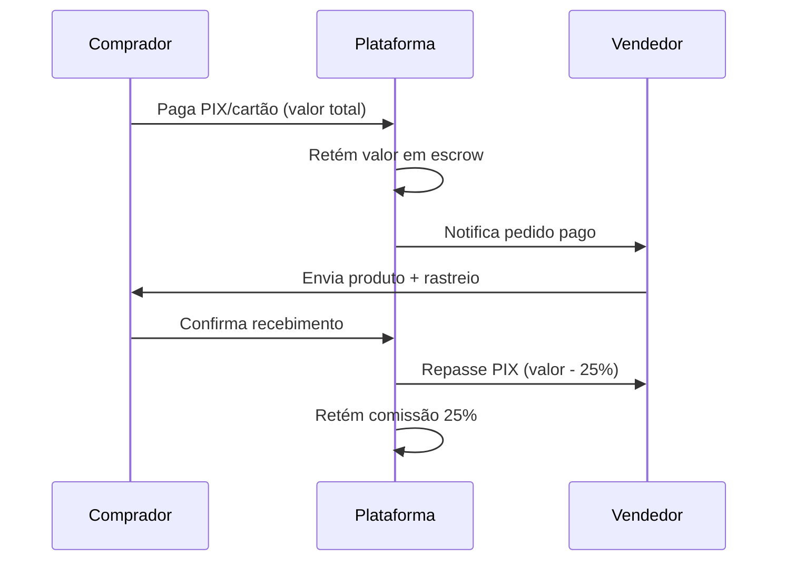

# Avroz Games Marketplace — Documentação da Aplicação

**Versão:** 2.0 (Multi-vendedor)  
**Atualizado:** 15/06/2026  
**URL produção:** https://avroz-games.github.io/

---

## 1. Visão geral

O **Avroz Games Marketplace** é uma plataforma estilo Mercado Livre para produtos gamer. A Avroz Games atua como **intermediadora**: vendedores cadastram produtos, compradores pagam pela plataforma, e o repasse ao vendedor ocorre somente após **confirmação de recebimento** (escrow).

### Modelo de negócio
| Item | Valor |
|------|-------|
| Comissão da plataforma | **25%** sobre o preço de venda |
| Desconto PIX | 10% (configurável) |
| Escrow | Retenção até confirmação do comprador ou 7 dias após entrega |
| Frete | Correios (cálculo por vendedor no checkout) |

---

## 2. Papéis de usuário

| Papel | Descrição | Acesso |
|-------|-----------|--------|
| **Comprador (customer)** | Cadastro, compra, acompanhamento de pedidos, confirmação de recebimento | `/cadastro`, `/minha-conta` |
| **Vendedor (seller)** | Cadastro de loja (aprovação admin), produtos, pedidos, rastreio | `/vendedor/*` |
| **Admin** | Aprovação de vendedores, moderação, escrow, configurações | `/admin/*` |

### Contas demo (modo local — localStorage)

| Papel | E-mail | Senha |
|-------|--------|-------|
| Admin | admin@avrozgames.com.br | avroz2024 |
| Comprador | cliente@demo.com | demo1234 |
| Vendedor 1 | vendedor1@demo.com | demo1234 |
| Vendedor 2 | vendedor2@demo.com | demo1234 |

> Limpe o localStorage ou use aba anônima na primeira visita para carregar dados demo.

---

## 3. Rotas e funcionalidades

### Loja pública
- `/` — Home com produtos em destaque e categorias
- `/produtos` — Catálogo com busca e filtros
- `/produto/:id` — Detalhe do produto (vendedor, frete, PIX)
- `/carrinho` — Carrinho multi-vendedor
- `/checkout` — Checkout com login obrigatório, frete por vendedor, PIX e escrow

### Autenticação
- `/entrar` — Login
- `/cadastro` — Cadastro comprador ou vendedor
- `/minha-conta` — Pedidos, status escrow, confirmar recebimento

### Vendedor
- `/vendedor/cadastro` — Completar cadastro da loja
- `/vendedor` — Dashboard (vendas, escrow)
- `/vendedor/produtos` — CRUD de produtos (preço vendedor + margem 25%)
- `/vendedor/pedidos` — Sub-pedidos, rastreio, status de envio

### Admin
- `/admin` — Login administrativo
- `/admin/dashboard` — Métricas marketplace
- `/admin/produtos` — Moderação de produtos
- `/admin/pedidos` — Pedidos e status escrow
- `/admin/vendedores` — Aprovar/rejeitar/suspender vendedores
- `/admin/configuracoes` — Comissão, PIX, frete, contato

### Jurídico
- `/legal/termos` — Termos de uso
- `/legal/privacidade` — Política LGPD
- `/legal/contrato-comprador` — Contrato do comprador
- `/legal/contrato-vendedor` — Contrato do vendedor

---

## 4. Fluxo de compra (escrow)



1. Comprador autenticado finaliza checkout e aceita contrato
2. Pagamento vai para chave PIX da **plataforma**
3. Por cada vendedor no carrinho, cria-se um **sub-pedido** com `escrow_status: held`
4. Vendedor atualiza status (preparando → enviado → entregue)
5. Comprador confirma em **Minha Conta** → `escrow_status: released` → registro de payout

---

## 5. Stack tecnológica

| Camada | Tecnologia |
|--------|------------|
| Frontend | React 18, TypeScript, Vite, Tailwind CSS |
| Roteamento | React Router v6 |
| Backend (prod) | Supabase (PostgreSQL, Auth, Storage, RLS) |
| Backend (demo) | localStorage via `localMarketplace.ts` |
| Deploy | GitHub Pages (`gh-pages`) |
| Frete | API Correios (simulada/local) |
| Pagamento | PIX estático (integração gateway recomendada para produção) |

---

## 6. Estrutura de pastas

```
src/
├── context/
│   ├── AuthContext.tsx       # Autenticação multi-papel
│   ├── MarketplaceContext.tsx # Produtos e configurações
│   └── CartContext.tsx       # Carrinho
├── services/
│   ├── marketplace.ts        # API unificada (Supabase + local)
│   └── localMarketplace.ts   # Demo offline
├── pages/
│   ├── auth/                 # Login, cadastro
│   ├── account/              # Minha conta
│   ├── seller/               # Painel vendedor
│   ├── admin/                # Painel admin
│   └── legal/                # Documentos jurídicos
├── content/
│   └── legalContent.ts       # Textos legais
supabase/
└── schema.sql                # Schema multi-vendedor + RLS
docs/
├── APPLICATION.md            # Este arquivo
└── SECURITY.md               # Segurança
```

---

## 7. Banco de dados (Supabase)

Tabelas principais: `profiles`, `sellers`, `products`, `orders`, `sub_orders`, `order_items`, `payouts`, `platform_settings`.

Execute `supabase/schema.sql` no SQL Editor do Supabase.

### Variáveis de ambiente

```env
VITE_SUPABASE_URL=https://seu-projeto.supabase.co
VITE_SUPABASE_ANON_KEY=sua-anon-key
VITE_BASE_PATH=/
```

---

## 8. Preços e margem

- **Preço do vendedor** (`seller_price`): valor definido pelo vendedor
- **Preço de venda** (`sale_price`): `seller_price / (1 - 0.25)` — margem de 25% embutida
- **Repasse vendedor**: 75% do preço de venda
- **Comissão plataforma**: 25% do preço de venda

---

## 9. Deploy

```bash
npm install
npm run build
# GitHub Actions publica em gh-pages automaticamente no push para main
```

---

## 10. Próximos passos recomendados (produção)

1. Integrar gateway de pagamento certificado (Mercado Pago, Pagar.me, Stripe)
2. Validar contratos com advogado e inserir CNPJ real
3. Configurar Supabase Auth com confirmação de e-mail
4. Webhooks para confirmação automática de PIX
5. Sistema de disputas/mediation com SLA
6. Notificações por e-mail (Resend, SendGrid)

---

**Contato:** contato@avrozgames.com.br
